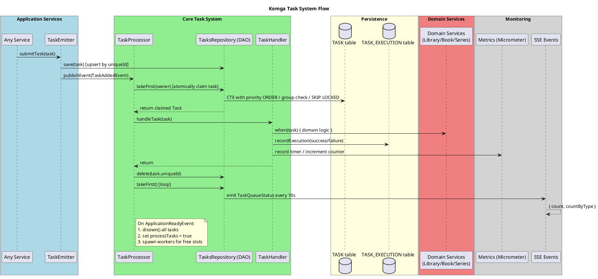

# Komga Task System

## Overview

Komga's task system is a **priority-based, database-backed asynchronous task queue** designed to handle all background processing. It follows a producer-consumer pattern where:

- **Producers** (services throughout the application) emit tasks via `TaskEmitter` 
- **Consumers** (the `TaskProcessor` thread pool) claim and execute tasks via `TaskHandler`
- Tasks are persisted in a **dedicated SQLite/PostgreSQL database** (`tasksDb`) separate from the main application database
- Execution history is recorded in a `TASK_EXECUTION` table for monitoring and debugging

The system is built for **crash resilience**, **idempotency**, **group-based concurrency control**, and **observability** via metrics and SSE events.

### Key Characteristics

| Feature | Implementation |
|---------|---------------|
| **Durability** | Tasks persisted in database — survive application restarts |
| **Crash Recovery** | On startup, all claimed tasks are returned to queued state (`disown()`) |
| **Idempotency** | `uniqueId` as primary key; `INSERT ON DUPLICATE KEY UPDATE` prevents duplicates |
| **Priority** | Higher integer = processed first (0-8 scale) |
| **Group Serialization** | Tasks with the same `groupId` execute one-at-a-time per group (e.g., same series) |
| **Concurrency** | Configurable thread pool (default: 1 worker) |
| **Observability** | Micrometer timers/counters + SSE events + execution history table |

---

## Architecture Flow

---

## Task Types

The sealed class `Task` defines all task types. Each has a `uniqueId` (used as the database primary key for deduplication), a `priority`, and an optional `groupId` for concurrency control.

### Priority Constants

| Constant | Value | Usage |
|----------|-------|-------|
| `HIGHEST_PRIORITY` | 8 | - |
| `HIGH_PRIORITY` | 6 | - |
| `DEFAULT_PRIORITY` | 4 | Default for most tasks |
| `LOW_PRIORITY` | 2 | Background maintenance |
| `LOWEST_PRIORITY` | 0 | Lowest urgency operations |

### Complete Task Reference

| Task Class | Fields | uniqueId Format | groupId | Priority | Category |
|-----------|--------|----------------|---------|----------|----------|
| `ScanLibrary` | `libraryId`, `scanDeep` | `SCAN_LIBRARY_{libraryId}_DEEP_{scanDeep}` | `null` | 4 | Library Scanning |
| `EmptyTrash` | `libraryId` | `EMPTY_TRASH_{libraryId}` | `null` | 4 | Library Maintenance |
| `FindBooksToConvert` | `libraryId` | `FIND_BOOKS_TO_CONVERT_{libraryId}` | `null` | 4 | Library Maintenance |
| `FindBooksWithMissingPageHash` | `libraryId` | `FIND_BOOKS_WITH_MISSING_PAGE_HASH_{libraryId}` | `null` | 4 | Library Maintenance |
| `FindDuplicatePagesToDelete` | `libraryId` | `FIND_DUPLICATE_PAGES_TO_DELETE_{libraryId}` | `null` | 4 | Library Maintenance |
| `FindBookThumbnailsToRegenerate` | `forBiggerResultOnly` | `FIND_BOOK_THUMBNAILS_TO_REGENERATE` | `null` | 4 | Library Maintenance |
| `AnalyzeBook` | `bookId`, `groupId` | `ANALYZE_BOOK_{bookId}` | `book.seriesId` | 4 | Book Analysis |
| `VerifyBookHash` | `bookId`, `groupId` | `VERIFY_BOOK_HASH_{bookId}` | `book.seriesId` | 4 | Book Analysis |
| `GenerateBookThumbnail` | `bookId` | `GENERATE_BOOK_THUMBNAIL_{bookId}` | `null` | 4 | Book Analysis |
| `HashBook` | `bookId` | `HASH_BOOK_{bookId}` | `null` | 0 | Book Hashing |
| `HashBookPages` | `bookId` | `HASH_BOOK_PAGES_{bookId}` | `null` | 4 | Book Hashing |
| `HashBookKoreader` | `bookId` | `HASH_BOOK_KOREADER_{bookId}` | `null` | 0 | Book Hashing |
| `RefreshBookMetadata` | `bookId`, `capabilities`, `groupId` | `REFRESH_BOOK_METADATA_{bookId}` | `book.seriesId` | 4 | Metadata |
| `RefreshSeriesMetadata` | `seriesId` | `REFRESH_SERIES_METADATA_{seriesId}` | `seriesId` | 4 | Metadata |
| `AggregateSeriesMetadata` | `seriesId` | `AGGREGATE_SERIES_METADATA_{seriesId}` | `seriesId` | 4 | Metadata |
| `RefreshBookLocalArtwork` | `bookId` | `REFRESH_BOOK_LOCAL_ARTWORK_{bookId}` | `null` | 4 | Artwork |
| `RefreshSeriesLocalArtwork` | `seriesId` | `REFRESH_SERIES_LOCAL_ARTWORK_{seriesId}` | `null` | 4 | Artwork |
| `ConvertBook` | `bookId`, `groupId` | `CONVERT_BOOK_{bookId}` | `book.seriesId` | 4 | Book Conversion |
| `RepairExtension` | `bookId`, `groupId` | `REPAIR_EXTENSION_{bookId}` | `book.seriesId` | 2 | Book Conversion |
| `ImportBook` | `sourceFile`, `seriesId`, `copyMode`, `destinationName`, `upgradeBookId` | `IMPORT_BOOK_{seriesId}_{sourceFile}` | `seriesId` | 4 | Import |
| `RemoveHashedPages` | `bookId`, `pages` | `REMOVE_HASHED_PAGES_{bookId}` | `null` | 4 | Page Hashing |
| `DeleteBook` | `bookId` | `DELETE_BOOK_{bookId}` | `null` | 4 | Deletion |
| `DeleteSeries` | `seriesId` | `DELETE_SERIES_{seriesId}` | `null` | 4 | Deletion |
| `RebuildIndex` | `entities` | `REBUILD_INDEX` | `null` | 4 | Search Index |
| `UpgradeIndex` | (none) | `UPGRADE_INDEX` | `null` | 4 | Search Index |

---

## Task Categories

### 1. Library Scanning

Triggered when a library is scanned (manually or automatically). This is the entry point for the majority of book processing tasks.

**`ScanLibrary`** — Scans the library root folder for new/changed files, then fans out into multiple sub-tasks:
1. `AnalyzeBook` for all books with `UNKNOWN` or `OUTDATED` media status
2. `RepairExtension` for books with mismatched file extensions (if `repairExtensions` is enabled for the library)
3. `FindBooksToConvert` to detect non-CBZ books
4. `FindBooksWithMissingPageHash` to detect books needing page-level hashing
5. `FindDuplicatePagesToDelete` to find duplicate pages across the library
6. `HashBook` for books without a file hash (if `hashFiles` is enabled)
7. `HashBookKoreader` for books without a KOReader hash (if `hashKoreader` is enabled)

### 2. Book Analysis

**`AnalyzeBook`** — Analyzes a book's media file (reads metadata, page count, etc.) and persists results. After analysis, conditionally emits:
- `GenerateBookThumbnail` if a new thumbnail needs to be generated
- `RefreshBookMetadata` if book metadata needs to be refreshed

**`VerifyBookHash`** — Verifies the book's stored hash against the actual file.

**`GenerateBookThumbnail`** — Generates the book's thumbnail image. **Note: Currently disabled (no-op)** with a TODO marker.

### 3. Book Hashing

**`HashBook`** — Computes the file-level hash of a book. Used for deduplication. Submitted at `LOWEST_PRIORITY` during library scan.

**`HashBookPages`** — Computes page-level hashes for books with missing page hashes.

**`HashBookKoreader`** — Computes KOReader-compatible hashes. Submitted at `LOWEST_PRIORITY` during library scan.

**`FindBooksWithMissingPageHash`** — Scans the library to find books that are missing page-level hashes and emits `HashBookPages` tasks.

**`FindDuplicatePagesToDelete`** — Scans the library to find duplicate pages across books and emits `RemoveHashedPages` tasks.

**`RemoveHashedPages`** — Removes hashed duplicate pages from a book file. If removal triggers a thumbnail change, emits `GenerateBookThumbnail`.

### 4. Metadata Processing

These tasks form a **chain**: `RefreshBookMetadata` → `RefreshSeriesMetadata` → `AggregateSeriesMetadata`.

**`RefreshBookMetadata`** — Refreshes a book's metadata using its capabilities. After completion, emits `RefreshSeriesMetadata` for the book's series.

**`RefreshSeriesMetadata`** — Refreshes all metadata for a series (aggregating from its books). After completion, emits `AggregateSeriesMetadata`.

**`AggregateSeriesMetadata`** — Computes aggregated/summary metadata for a series (e.g., total page count, read progress, etc.).

### 5. Artwork / Local Artwork

**`RefreshBookLocalArtwork`** — Refreshes local artwork (sidecar images) for a book.

**`RefreshSeriesLocalArtwork`** — Refreshes local artwork for a series.

### 6. Book Conversion

**`FindBooksToConvert`** — Scans a library to find books that need conversion (non-CBZ format) and emits `ConvertBook` tasks.

**`ConvertBook`** — Converts a book to CBZ format (the preferred format in Komga).

**`RepairExtension`** — Fixes mismatched file extensions for books. Submitted at `LOW_PRIORITY` during library scan (only if `repairExtensions` is enabled for the library).

### 7. Book Import

**`ImportBook`** — Imports a book from an external source file into a series. Supports different `CopyMode` values (copy, move, hardlink). After import, emits `AnalyzeBook` for the newly imported book.

### 8. Deletion

**`DeleteBook`** — Deletes a book. If the book is a **oneshot** (single-book series), it deletes the entire series files instead.

**`DeleteSeries`** — Deletes all files belonging to a series.

### 9. Search Index

**`RebuildIndex`** — Rebuilds the Lucene search index. Can target specific entity types via the `entities` parameter.

**`UpgradeIndex`** — Upgrades the Lucene search index to the latest version.

### 10. Library Maintenance

**`EmptyTrash`** — Empties the trash for a library (permanently deletes files that were moved to trash).

**`FindBookThumbnailsToRegenerate`** — Scans all books to find those needing thumbnail regeneration and emits `GenerateBookThumbnail` tasks (currently disabled).

---

## Database Schema

The task system uses a separate database (`tasksDb`) managed by its own Flyway migrations. Two tables exist: `TASK` for the queue and `TASK_EXECUTION` for history.

### `TASK` Table

| Column | Type | Description |
|--------|------|-------------|
| `ID` | `varchar` (PK) | Task's `uniqueId` (e.g., `SCAN_LIBRARY_lib123_DEEP_true`) |
| `PRIORITY` | `integer` | Higher = processed first |
| `GROUP_ID` | `varchar` | Concurrency group key (usually seriesId); may be null |
| `CLASS` | `varchar` | Full class name for Jackson deserialization |
| `SIMPLE_TYPE` | `varchar` | Simple class name for filtering (e.g., `ScanLibrary`) |
| `PAYLOAD` | `text` | JSON-serialized Task object |
| `OWNER` | `varchar` | Thread name when claimed by a worker; `null` when queued |
| `CREATED_DATE` | `timestamp` | Auto-set to `CURRENT_TIMESTAMP` |
| `LAST_MODIFIED_DATE` | `timestamp` | Updated on upsert; used for ordering |

**Indexes:**
- `idx__tasks__owner_group_id` on (`OWNER`, `GROUP_ID`)
- PostgreSQL-only: `idx_task_queue` — filtered index (`OWNER IS NULL`) on (`OWNER`, `PRIORITY DESC`, `LAST_MODIFIED_DATE`)
- PostgreSQL-only: `idx_task_owner_group` — filtered index (`OWNER IS NOT NULL AND GROUP_ID IS NOT NULL`) on (`OWNER`, `GROUP_ID`)

### `TASK_EXECUTION` Table

| Column | Type | Description |
|--------|------|-------------|
| `ID` | `varchar` (PK) | Random 8-character execution ID |
| `SIMPLE_TYPE` | `varchar` | e.g., `ScanLibrary` |
| `TASK_ID` | `varchar` | Original task's `uniqueId` |
| `LIBRARY_ID` | `varchar` | Library context (if applicable) |
| `SERIES_ID` | `varchar` | Series context (if applicable) |
| `BOOK_ID` | `varchar` | Book context (if applicable) |
| `START_DATE` | `timestamp` | When execution started |
| `END_DATE` | `timestamp` | When execution ended (`null` on failure) |
| `SUCCESS` | `boolean` / `integer` | PostgreSQL: boolean; SQLite: integer 0/1 |
| `ERROR_MESSAGE` | `text` | Error details (if failed) |
| `DURATION_MILLIS` | `bigint` | Execution duration (if successful) |

**Indexes:**
- `idx__task_execution__library_id` on (`LIBRARY_ID`)
- `idx__task_execution__start_date` on (`START_DATE DESC`)
- `idx__task_execution__simple_type` on (`SIMPLE_TYPE`)

---

## Detailed Component Breakdown

### 1. TaskEmitter (Producer)

**File:** `TaskEmitter.kt`

The `TaskEmitter` is the single entry point for submitting tasks. It provides typed methods for every task type and handles:

- **Single task submission:** Calls `tasksRepository.save(task)` followed by `eventPublisher.publishEvent(TaskAddedEvent)`
- **Batch task submission:** Calls `tasksRepository.save(tasks)` (batch) followed by `eventPublisher.publishEvent(TaskAddedEvent)`
- **Fan-out patterns:** Many emitter methods (e.g., `analyzeUnknownAndOutdatedBooks`, `hashBooksWithoutHash`) query the database to find candidate books and emit individual tasks for each

```kotlin
private fun submitTask(task: Task) {
    tasksRepository.save(task)
    eventPublisher.publishEvent(TaskAddedEvent)
}
```

### 2. TasksRepository / TasksDao (Queue)

**Files:** `TasksRepository.kt`, `TasksDao.kt`

The `TasksRepository` interface defines the queue operations. The `TasksDao` implements it using jOOQ against the `tasksDb`.

#### Task Claiming (`takeFirst`)

This is the most critical operation. It uses a **CTE (Common Table Expression)** to atomically claim the next available task:

```sql
WITH candidate AS (
  SELECT "ID"
  FROM "TASK"
  WHERE "OWNER" IS NULL
    AND (
      "GROUP_ID" IS NULL
      OR NOT EXISTS (
        SELECT 1 FROM "TASK" t2
        WHERE t2."GROUP_ID" = "TASK"."GROUP_ID"
          AND t2."OWNER" IS NOT NULL
          AND t2."GROUP_ID" IS NOT NULL
      )
    )
  ORDER BY "PRIORITY" DESC, "LAST_MODIFIED_DATE"
  LIMIT 1
  -- POSTGRESQL ONLY: FOR UPDATE SKIP LOCKED
)
UPDATE "TASK"
SET "OWNER" = ?
WHERE "ID" = (SELECT "ID" FROM candidate)
RETURNING "CLASS", "PAYLOAD"
```

Key behaviors:
- **Picks the highest priority task** (ties broken by `LAST_MODIFIED_DATE`)
- **Respects group concurrency**: If any task with a non-null `GROUP_ID` is already running, other tasks in the same group are skipped
- **Atomic claim**: The `UPDATE ... RETURNING` atomically marks the task as owned and returns its serialized data
- **PostgreSQL SKIP LOCKED**: On PostgreSQL, uses `FOR UPDATE SKIP LOCKED` to avoid row-level lock contention
- **SQLite fallback**: SQLite doesn't support `SKIP LOCKED`, so the locking clause is omitted

#### Task Persistence (`save`)

Tasks are serialized to JSON via Jackson `ObjectMapper` and stored. The save uses `ON DUPLICATE KEY UPDATE`:

```sql
INSERT INTO "TASK" ("ID", "PRIORITY", ...)
VALUES (?, ?, ...)
ON DUPLICATE KEY UPDATE
  "PRIORITY" = ?,
  "PAYLOAD" = ?,
  "LAST_MODIFIED_DATE" = NOW()
```

This means:
- Submitting the same task twice is idempotent — it just updates priority/payload
- The `LAST_MODIFIED_DATE` is always updated, ensuring fair ordering

#### Crash Recovery (`disown`)

On application startup, `disown()` sets `OWNER = NULL` for all tasks that were claimed (running when the application crashed). This prevents orphaned tasks:

```sql
UPDATE "TASK" SET "OWNER" = NULL WHERE "OWNER" IS NOT NULL
```

### 3. TaskProcessor (Consumer)

**File:** `TaskProcessor.kt`

The `TaskProcessor` manages the worker thread pool and task consumption loop.

#### Initialization (`afterPropertiesSet`)

1. Calls `tasksRepository.disown()` — resets all running tasks to queued (crash recovery)
2. Sets `processTasks = true`

#### Event-Driven Processing

Listens for two event types:
- **`TaskAddedEvent`** — Emitted whenever a new task is submitted
- **`ApplicationReadyEvent`** — Fired once on application startup

On either event, the processor:
1. Calculates free slots: `corePoolSize - activeCount`
2. Spawns worker threads for each free slot

#### Worker Loop (`takeAndProcess`)

Each worker thread:
1. Calls `tasksRepository.takeFirst()` to atomically claim a task
2. If successful: calls `taskHandler.handleTask(task)` then `tasksRepository.delete(task.uniqueId)`
3. Loops: tries `takeFirst()` again — continues until no tasks are available
4. Goes idle when the queue is empty

```kotlin
private fun takeAndProcess() {
    var task = tasksRepository.takeFirst()
    while (task != null) {
        taskHandler.handleTask(task)
        tasksRepository.delete(task.uniqueId)
        task = tasksRepository.takeFirst()
    }
}
```

#### Dynamic Pool Resizing

Listens for `SettingChangedEvent.TaskPoolSize` and updates the executor's `corePoolSize` dynamically, allowing administrators to change concurrency at runtime.

### 4. TaskHandler (Dispatcher)

**File:** `TaskHandler.kt`

The `TaskHandler` is the central dispatcher that routes each `Task` subtype to the appropriate domain service. It handles:

1. **Context extraction**: Extracts `libraryId()`, `seriesId()`, `bookId()` via extension functions
2. **Execution timing**: Wraps execution in `measureTime { ... }` for metrics
3. **Routing**: A `when` block dispatches each task to the correct domain service
4. **Execution recording**: Saves the result to `TASK_EXECUTION` table
5. **Metrics publishing**: Records Micrometer timer (`komga.tasks.execution`) and failure counter (`komga.tasks.failure`)

#### Routing Matrix

| Task | Domain Service | Post-Execution Fan-out |
|------|---------------|----------------------|
| `ScanLibrary` | `libraryContentLifecycle.scanRootFolder()` | `AnalyzeBook`, `RepairExtension`, `FindBooksToConvert`, `FindBooksWithMissingPageHash`, `FindDuplicatePagesToDelete`, `HashBook`, `HashBookKoreader` |
| `FindBooksToConvert` | `taskEmitter.convertBookToCbz()` | `ConvertBook` tasks |
| `FindBooksWithMissingPageHash` | `taskEmitter.hashBookPages()` | `HashBookPages` tasks |
| `FindDuplicatePagesToDelete` | `taskEmitter.removeDuplicatePages()` | `RemoveHashedPages` tasks |
| `EmptyTrash` | `libraryContentLifecycle.emptyTrash()` | — |
| `AnalyzeBook` | `bookLifecycle.analyzeAndPersist()` | `GenerateBookThumbnail` / `RefreshBookMetadata` (conditional) |
| `VerifyBookHash` | `bookLifecycle.verifyHashAndPersist()` | — |
| `GenerateBookThumbnail` | `bookLifecycle.generateThumbnailAndPersist()` | — |
| `RefreshBookMetadata` | `bookMetadataLifecycle.refreshMetadata()` | `RefreshSeriesMetadata` |
| `RefreshSeriesMetadata` | `seriesMetadataLifecycle.refreshMetadata()` | `AggregateSeriesMetadata` |
| `AggregateSeriesMetadata` | `seriesMetadataLifecycle.aggregateMetadata()` | — |
| `RefreshBookLocalArtwork` | `localArtworkLifecycle.refreshLocalArtwork(book)` | — |
| `RefreshSeriesLocalArtwork` | `localArtworkLifecycle.refreshLocalArtwork(series)` | — |
| `ImportBook` | `bookImporter.importBook()` | `AnalyzeBook` |
| `ConvertBook` | `bookConverter.convertToCbz()` | — |
| `RepairExtension` | `bookConverter.repairExtension()` | — |
| `RemoveHashedPages` | `bookPageEditor.removeHashedPages()` | `GenerateBookThumbnail` (conditional) |
| `HashBook` | `bookLifecycle.hashAndPersist()` | — |
| `HashBookKoreader` | `bookLifecycle.hashKoreaderAndPersist()` | — |
| `HashBookPages` | `bookLifecycle.hashPagesAndPersist()` | — |
| `RebuildIndex` | `searchIndexLifecycle.rebuildIndex()` | — |
| `UpgradeIndex` | `searchIndexLifecycle.upgradeIndex()` | — |
| `DeleteBook` | `seriesLifecycle.deleteSeriesFiles()` or `bookLifecycle.deleteBookFiles()` | — |
| `DeleteSeries` | `seriesLifecycle.deleteSeriesFiles()` | — |
| `FindBookThumbnailsToRegenerate` | `taskEmitter.generateBookThumbnail()` | `GenerateBookThumbnail` tasks |

### 5. Task Execution History

**Files:** `TaskExecution.kt`, `TaskExecutionRepository.kt`

Every task execution (success or failure) is recorded in the `TASK_EXECUTION` table. The `recordExecution()` method in `TaskHandler`:

- Generates a random 8-character execution ID
- Records start/end timestamps, success status, error message, and duration
- Handles recording failures gracefully (logs a warning, never crashes the task handler)

### 6. Domain Models

#### Task (Sealed Class)

```kotlin
sealed class Task(
    val priority: Int = DEFAULT_PRIORITY,
    val groupId: String? = null,
) {
    abstract val uniqueId: String
    // 26 subclasses (see full reference above)
}
```

#### TaskExecution

```kotlin
data class TaskExecution(
    val id: String,              // random 8-char UUID
    val simpleType: String,       // e.g. "ScanLibrary"
    val taskId: String?,          // uniqueId from the original Task
    val libraryId: String?,
    val seriesId: String?,
    val bookId: String?,
    val startDate: LocalDateTime,
    val endDate: LocalDateTime?,
    val success: Boolean,
    val errorMessage: String?,
    val durationMillis: Long?,
)
```

---

## API Endpoints

All endpoints require `ADMIN` role. Base path: `/api/v1/tasks`

| Method | Path | Description | Parameters |
|--------|------|-------------|------------|
| `GET` | `/api/v1/tasks` | List queued/running tasks (paginated) | `page`, `size`, `sort`, `status` (QUEUED/RUNNING), `simpleType` |
| `DELETE` | `/api/v1/tasks` | Cancel all queued tasks | none (returns count of deleted) |
| `GET` | `/api/v1/tasks/executions` | List execution history (paginated) | `page`, `size`, `sort`, `simpleType`, `libraryId`, `success` |
| `GET` | `/api/v1/tasks/executions/recent-failures` | Recent failed executions | `limit` (default: 20) |
| `GET` | `/api/v1/tasks/executions/summary` | Aggregated stats by type & library | `libraryId` (optional filter) |

### Task Status

The `status` field in API responses is derived from the `OWNER` column:
- `OWNER = null` → `QUEUED`
- `OWNER != null` → `RUNNING`

### DTOs

#### TaskDto (Queue listing)
```kotlin
data class TaskDto(
    val id: String,
    val simpleType: String,
    val status: TaskStatusDto,    // QUEUED or RUNNING
    val owner: String?,
    val priority: Int,
    val groupId: String?,
    val createdDate: LocalDateTime,
    val lastModifiedDate: LocalDateTime,
    val durationMillis: Long,     // time elapsed since createdDate
)
```

#### TaskExecutionDto (Execution history)
```kotlin
data class TaskExecutionDto(
    val id: String,
    val simpleType: String,
    val taskId: String?,
    val libraryId: String?,
    val seriesId: String?,
    val bookId: String?,
    val startDate: LocalDateTime,
    val endDate: LocalDateTime?,
    val success: Boolean,
    val errorMessage: String?,
    val durationMillis: Long?,
)
```

#### TaskExecutionSummaryDto (Aggregated stats)
```kotlin
data class TaskExecutionSummaryDto(
    val simpleType: String,
    val libraryId: String?,
    val totalCount: Long,
    val successCount: Long,
    val failureCount: Long,
    val avgDurationMillis: Double?,
    val minDurationMillis: Long?,
    val maxDurationMillis: Long?,
    val lastExecutionDate: LocalDateTime?,
)
```

---

## Monitoring & Observability

### Micrometer Metrics

Two metrics are registered in `MetricsPublisherController`:

| Metric Name | Type | Description | Tags |
|------------|------|-------------|------|
| `komga.tasks.execution` | Timer | Measures task execution duration | `type` (e.g., `ScanLibrary`) |
| `komga.tasks.failure` | Counter | Counts task failures | `type` (e.g., `ScanLibrary`) |

Metrics are published with every task execution/failure.

### SSE (Server-Sent Events)

The backend emits `TaskQueueStatus` events every 10 seconds via the SSE endpoint (`sse/v1/events`):

```json
{
    "count": 42,
    "countByType": {
        "AnalyzeBook": 30,
        "HashBook": 10,
        "ScanLibrary": 2
    }
}
```

This is defined as:
```kotlin
data class TaskQueueSseDto(
    val count: Int,
    val countByType: Map<String, Int>,
)
```

---

## Lifecycle Flows

### Full Library Scan Flow

@startuml
title Full Library Scan Flow

participant "User/Trigger" as User
participant "TaskEmitter" as Emitter
participant "TaskQueue" as Queue
participant "TaskProcessor" as Processor
participant "LibraryContentLifecycle" as LCL
participant "TaskHandler" as Handler

User -> Emitter: scanLibrary(libraryId)
Emitter -> Queue: save(ScanLibrary)
Emitter -> Processor: TaskAddedEvent

Processor -> Queue: takeFirst()
Queue --> Processor: ScanLibrary

Processor -> Handler: handleTask(ScanLibrary)
Handler -> LCL: scanRootFolder(library, scanDeep)
LCL --> Handler: done

Handler -> Emitter: analyzeUnknownAndOutdatedBooks(library)
Emitter -> Queue: save(AnalyzeBook) × N
Emitter -> Processor: TaskAddedEvent

Handler -> Emitter: repairExtensions(library, LOW_PRIORITY)
Emitter -> Queue: save(RepairExtension) × M

Handler -> Emitter: findBooksToConvert(library, LOWEST_PRIORITY)
Emitter -> Queue: save(FindBooksToConvert)

Handler -> Emitter: hashBooksWithoutHash(library)
Emitter -> Queue: save(HashBook) × K

Handler -> Emitter: hashBooksWithoutHashKoreader(library)
Emitter -> Queue: save(HashBookKoreader) × J

Handler -> Handler: recordExecution(success=true)

Processor -> Queue: delete(ScanLibrary)

note right of Processor
   Processor continues with
   next available task
   (e.g., AnalyzeBook tasks)
end note

@enduml

### Metadata Refresh Chain

@startuml
title Metadata Refresh Chain

participant "TaskQueue" as Queue
participant "TaskProcessor" as Processor
participant "TaskHandler" as Handler
participant "BookMetadataLifecycle" as BML
participant "SeriesMetadataLifecycle" as SML
participant "TaskEmitter" as Emitter

Queue --> Processor: RefreshBookMetadata

Processor -> Handler: handleTask(RefreshBookMetadata)
Handler -> BML: refreshMetadata(book, capabilities)
BML --> Handler: done

Handler -> Emitter: refreshSeriesMetadata(seriesId)
Emitter -> Queue: save(RefreshSeriesMetadata)
Emitter -> Processor: TaskAddedEvent

Handler -> Handler: recordExecution(success=true)
Processor -> Queue: delete(RefreshBookMetadata)

Queue --> Processor: RefreshSeriesMetadata
Processor -> Handler: handleTask(RefreshSeriesMetadata)
Handler -> SML: refreshMetadata(series)
SML --> Handler: done

Handler -> Emitter: aggregateSeriesMetadata(seriesId)
Emitter -> Queue: save(AggregateSeriesMetadata)
Emitter -> Processor: TaskAddedEvent

Handler -> Handler: recordExecution(success=true)
Processor -> Queue: delete(RefreshSeriesMetadata)

Queue --> Processor: AggregateSeriesMetadata
Processor -> Handler: handleTask(AggregateSeriesMetadata)
Handler -> SML: aggregateMetadata(series)
SML --> Handler: done

Handler -> Handler: recordExecution(success=true)
Processor -> Queue: delete(AggregateSeriesMetadata)

@enduml

### Task Lifecycle State Machine

@startuml
title Task State Machine

state "SUBMITTED" as Submitted
state "QUEUED" as Queued
state "RUNNING" as Running
state "COMPLETED" as Completed
state "FAILED" as Failed
state "CANCELLED" as Cancelled

[*] --> Submitted: TaskEmitter.submitTask()
Submitted --> Queued: tasksRepository.save()\n(stored in DB with OWNER=null)

Queued --> Running: tasksRepository.takeFirst()\n(OWNER set to thread name)
Queued --> Cancelled: DELETE /api/v1/tasks\n(deleteAllWithoutOwner)

Running --> Completed: taskHandler.handleTask()\nsucceeds
Running --> Failed: taskHandler.handleTask()\nthrows exception

Completed --> [*]: tasksRepository.delete()\n(removed from queue)
Failed --> [*]: tasksRepository.delete()\n(removed from queue)
Cancelled --> [*]: tasksRepository.deleteAllWithoutOwner()

note right of Running
  On crash: disown() resets
  OWNER=null → QUEUED
end note

@enduml

---

## Configuration

The task system's thread pool size is controlled by a setting:

| Setting | Key | Default | Description |
|---------|-----|---------|-------------|
| Task Pool Size | `taskPoolSize` | 1 | Number of concurrent task worker threads |

The setting can be changed at runtime — the `TaskProcessor` listens for `SettingChangedEvent.TaskPoolSize` and updates the executor's `corePoolSize` dynamically.

The database connection uses a configurable batch chunk size for bulk inserts:
```properties
komga.tasks-db.batch-chunk-size
```

---

## File Reference

### Core Domain (`application/tasks/`)

| File | Description |
|------|-------------|
| `Task.kt` | Sealed class with all 26 task subtypes and priority constants |
| `TaskAddedEvent.kt` | Event published when a task is queued |
| `TaskEmitter.kt` | Producer — typed methods for submitting each task type |
| `TaskExecution.kt` | Execution history domain model |
| `TaskExecutionRepository.kt` | Repository interface + DTOs for execution history |
| `TaskHandler.kt` | Central dispatcher routing tasks to domain services |
| `TaskProcessor.kt` | Consumer — thread pool manager + worker loop |
| `TasksRepository.kt` | Repository interface for the task queue |

### Infrastructure (`infrastructure/jooq/tasks/`)

| File | Description |
|------|-------------|
| `TasksDao.kt` | jOOQ implementation of `TasksRepository` |
| `TaskDtoDao.kt` | DAO for paginated task DTO queries (API) |
| `TaskExecutionDao.kt` | DAO for execution history persistence (API) |

### API Layer (`interfaces/api/`)

| File | Description |
|------|-------------|
| `rest/TaskController.kt` | REST controller for task queue + execution endpoints |
| `rest/dto/TaskDto.kt` | Task DTO + `TaskStatusDto` enum |
| `rest/dto/TaskExecutionDto.kt` | Execution history DTO |
| `rest/dto/TaskExecutionSummaryDto.kt` | Aggregated execution summary DTO |
| `persistence/TaskDtoRepository.kt` | Repository interface for task DTO queries |
| `persistence/TaskExecutionDtoRepository.kt` | Repository interface for execution DTO queries |

### SSE Events

| File | Description |
|------|-------------|
| `sse/dto/TaskQueueSseDto.kt` | SSE DTO for real-time queue status |
| `sse/SseController.kt` | SSE endpoint controller |

### Metrics

| File | Description |
|------|-------------|
| `scheduler/MetricsPublisherController.kt` | Registers and publishes Micrometer metrics for tasks |

### Database Migrations

| File | Description |
|------|-------------|
| `tasks/migration/postgresql/V20231013114850__tasks.sql` | PostgreSQL: Creates `TASK` table |
| `tasks/migration/sqlite/V20231013114850__tasks.sql` | SQLite: Creates `TASK` table |
| `tasks/migration/postgresql/V20260801000000__task_execution.sql` | PostgreSQL: Creates `TASK_EXECUTION` table |
| `tasks/migration/sqlite/V20260801000000__task_execution.sql` | SQLite: Creates `TASK_EXECUTION` table |
| `tasks/migration/postgresql/V20260909000000__task_queue_performance_indexes.sql` | PostgreSQL: Performance indexes for `TASK` table |

### Frontend (WebUI)

| File | Description |
|------|-------------|
| `komga-webui/src/types/komga-tasks.ts` | TypeScript type definitions |
| `komga-webui/src/services/komga-tasks.service.ts` | HTTP client for task API endpoints |
| `komga-webui/src/plugins/komga-tasks.plugin.ts` | Vue plugin for task monitoring |

### Tests

| File | Description |
|------|-------------|
| `TaskProcessorTest.kt` | Tests for task processor logic |
| `TasksDaoTest.kt` | Tests for task queue DAO operations |
| `TaskExecutionDaoTest.kt` | Tests for execution history DAO |
| `TaskControllerTest.kt` | Tests for REST API endpoints |
