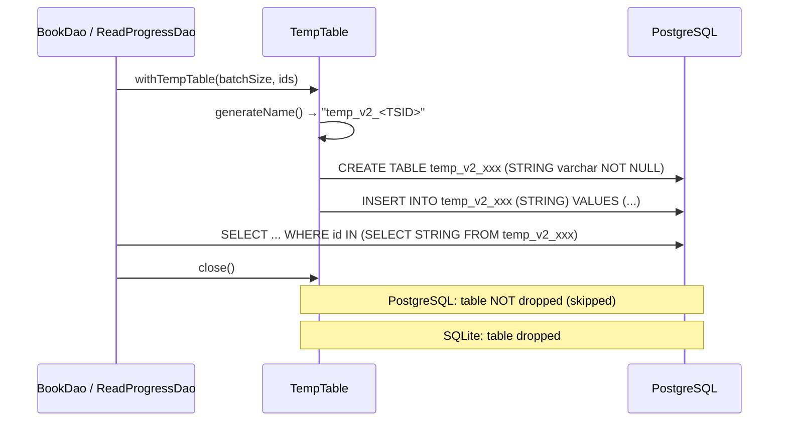
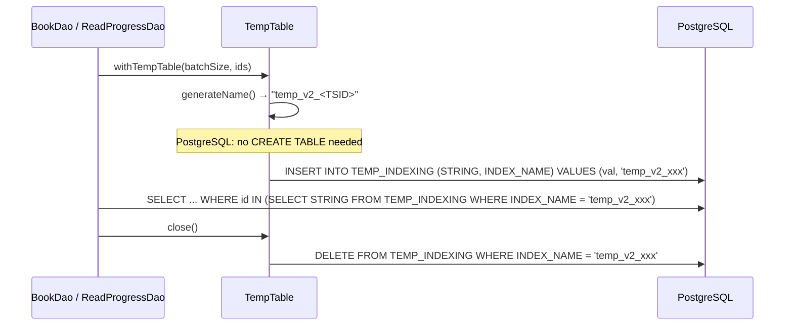
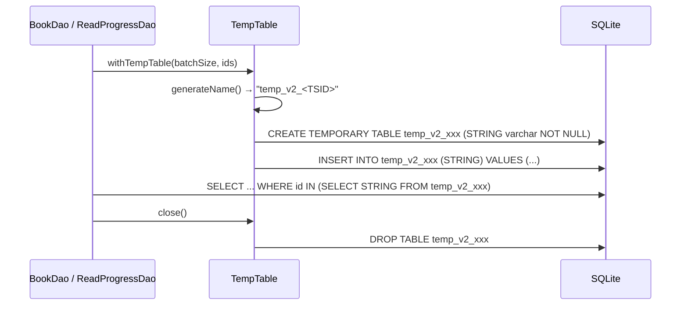

# PostgreSQL TEMP_INDEXING Table Solution

## Problem Statement

The current `TempTable.kt` creates **dynamic unlogged tables** for PostgreSQL at runtime (e.g., `temp_v2_<TSID>`). This approach has several issues:

1. **Table accumulation** — On PostgreSQL, the `close()` method skips dropping the table, so unlogged tables persist and accumulate over time
2. **No indexing** — The dynamically created tables have no index on the `STRING` column, making `IN (subselect)` queries slow on large datasets
3. **DDL overhead** — `CREATE TABLE` is a DDL statement that can cause catalog bloat and contention in PostgreSQL
4. **No concurrency isolation** — Without a discriminator column, multiple concurrent operations cannot safely share a single table

## Current Architecture



**Usage pattern across 13 DAOs:**
- `withTempTable(batchSize, collection)` → insert + select
- `TempTable(dsl).use { ... }` → manual control (e.g., `BookDtoDao` conditional creation)
- ~25 call sites total

## Proposed Solution

### Core Idea

Replace dynamic table creation for PostgreSQL with a **permanent `TEMP_INDEXING` table** that has an `INDEX_NAME` discriminator column. Each TempTable instance uses a unique `INDEX_NAME` value to isolate its data, then deletes its rows on `close()`.

### New Table Schema

```sql
CREATE UNLOGGED TABLE "TEMP_INDEXING" (
    "STRING"     varchar NOT NULL,
    "INDEX_NAME" varchar NOT NULL
);

CREATE INDEX "idx__temp_indexing__index_name" ON "TEMP_INDEXING" ("INDEX_NAME");
```

> [!IMPORTANT]
> The `INDEX_NAME` index is critical — without it, every `INSERT`, `SELECT`, and `DELETE` scoped to a specific `INDEX_NAME` would require a full table scan.

### Architecture After Change





## Detailed Changes

---

### 1. Flyway Migration (PostgreSQL only)

#### [NEW] `V20260409000000__temp_indexing_table.sql`

Location: `komga/src/flyway/resources/db/migration/postgresql/`

```sql
-- Create permanent TEMP_INDEXING table for PostgreSQL
-- Replaces the dynamic unlogged table approach in TempTable.kt
CREATE UNLOGGED TABLE "TEMP_INDEXING" (
    "STRING"     varchar NOT NULL,
    "INDEX_NAME" varchar NOT NULL
);

CREATE INDEX "idx__temp_indexing__index_name" ON "TEMP_INDEXING" ("INDEX_NAME");
```

> [!TIP]
> Using `UNLOGGED` avoids WAL writes for this high-churn table, providing significant performance gains. Data loss on crash is acceptable since this is transient data.

#### [MODIFY] `V001__initial_migration.sql`

Add the `TEMP_INDEXING` table and index at the end (before final indices block or at the very end) for fresh PostgreSQL installs.

---

### 2. TempTable.kt Changes

#### [MODIFY] [TempTable.kt](file:///Users/teamcumahay/Documents/GitHub/komga/komga/src/main/kotlin/org/gotson/komga/infrastructure/jooq/TempTable.kt)

The key change is making the behavior **dialect-aware** in four methods:

**`create()`** — PostgreSQL skips table creation:

```kotlin
fun create() {
    val dialect = dslContext.dialect()
    if (isPostgres(dialect)) {
        // PostgreSQL uses the permanent TEMP_INDEXING table — no DDL needed
        created = true
        return
    }
    // SQLite: create temporary table as before
    val sql = "CREATE TEMPORARY TABLE IF NOT EXISTS $name (STRING varchar NOT NULL);"
    dslContext.execute(sql)
    created = true
}
```

**`insertTempStrings()`** — PostgreSQL inserts with INDEX_NAME:

```kotlin
fun insertTempStrings(batchSize: Int, collection: Collection<String>) {
    if (!created) create()
    if (collection.isEmpty()) return

    val dialect = dslContext.dialect()

    collection.chunked(batchSize).forEach { chunk ->
        if (isPostgres(dialect)) {
            dslContext
                .batch(
                    dslContext.insertInto(
                        DSL.table(DSL.name("TEMP_INDEXING")),
                        DSL.field(DSL.name("STRING"), String::class.java),
                        DSL.field(DSL.name("INDEX_NAME"), String::class.java),
                    ).values(null as String?, null as String?),
                ).also { step ->
                    chunk.forEach { step.bind(it, name) }
                }.execute()
        } else {
            dslContext
                .batch(
                    dslContext.insertInto(
                        DSL.table(DSL.name(name)),
                        DSL.field(DSL.name("STRING"), String::class.java),
                    ).values(null as String?),
                ).also { step ->
                    chunk.forEach { step.bind(it) }
                }.execute()
        }
    }
}
```

**`selectTempStrings()`** — PostgreSQL filters by INDEX_NAME:

```kotlin
fun selectTempStrings() =
    if (isPostgres(dslContext.dialect())) {
        dslContext
            .select(DSL.field(DSL.name("STRING"), String::class.java))
            .from(DSL.table(DSL.name("TEMP_INDEXING")))
            .where(DSL.field(DSL.name("INDEX_NAME"), String::class.java).eq(name))
    } else {
        dslContext
            .select(DSL.field(DSL.name("STRING"), String::class.java))
            .from(DSL.table(DSL.name(name)))
    }
```

**`close()`** — PostgreSQL deletes rows instead of dropping table:

```kotlin
override fun close() {
    if (!created) return
    val dialect = dslContext.dialect()
    try {
        if (isPostgres(dialect)) {
            dslContext
                .deleteFrom(DSL.table(DSL.name("TEMP_INDEXING")))
                .where(DSL.field(DSL.name("INDEX_NAME"), String::class.java).eq(name))
                .execute()
        } else {
            dslContext.dropTableIfExists(name).execute()
        }
    } catch (e: Exception) {
        logger.warn { "Error cleaning up temp data for $name: ${e.message}" }
    }
}
```

**Helper:**

```kotlin
private fun isPostgres(dialect: org.jooq.SQLDialect): Boolean =
    dialect.name.lowercase().contains("postgres")
```

---

### 3. No DAO Changes Required

All 13 DAOs use TempTable through the same API (`withTempTable`, `insertTempStrings`, `selectTempStrings`, `close`). Since the API contract doesn't change, **no DAO modifications are needed**.

## Design Decisions & Trade-offs

| Aspect | Dynamic Tables (current) | PG TEMPORARY TABLE | Permanent TEMP_INDEXING (proposed) |
|--------|------------------------|-------------------|-----------------------------------|
| DDL per operation | `CREATE TABLE` each time | `CREATE TEMP TABLE` each time | None |
| Catalog bloat | Yes (unlogged tables persist) | No (session-scoped) | No (single table) |
| Cross-connection visibility | Yes | No (session-private) | Yes (need INDEX_NAME filter) |
| Index support | No | Possible but adds DDL | Yes (pre-created) |
| Cleanup | Manual DROP (currently skipped) | Automatic on disconnect | DELETE by INDEX_NAME |
| Connection pool compatibility | Problematic | Problematic with pools | Works naturally |

> [!NOTE]
> PostgreSQL TEMPORARY tables are session-scoped and invisible across connections. With connection pooling (HikariCP), the same connection may serve different requests, making temp table lifecycle management tricky. The permanent table approach avoids this entirely.

### Why UNLOGGED?

- `TEMP_INDEXING` holds transient data that's deleted within the same request
- If the server crashes, orphaned rows are harmless (and the table gets truncated on recovery for UNLOGGED tables)
- UNLOGGED tables skip WAL writes → **~2x faster** for write-heavy operations

### Concurrency Safety

Each `TempTable` instance generates a unique `name` via `TsidCreator.getTsid256()`. This TSID is used as the `INDEX_NAME` value, guaranteeing isolation between concurrent operations.

## Files to Change

| File | Action | Description |
|------|--------|-------------|
| `V20260409000000__temp_indexing_table.sql` | **NEW** | Migration to create `TEMP_INDEXING` table (PostgreSQL) |
| `V001__initial_migration.sql` | **MODIFY** | Add `TEMP_INDEXING` for fresh installs |
| `TempTable.kt` | **MODIFY** | Dialect-aware logic for all 4 methods |

## Open Questions

> [!IMPORTANT]
> 1. **Migration version number**: Should we use `V20260409000000` or a different format? The PG migrations currently only have `V001__`, `V20200730...`, `V20220106...`
> 2. **Cleanup of orphaned tables**: Should we add a step in the migration to drop existing `temp_v2_*` tables?
> 3. **UNLOGGED vs regular**: UNLOGGED is faster but data is lost on crash. Since this is transient data, UNLOGGED seems safe. Agree?

## Verification Plan

### Automated
1. `./gradlew build` — ensure compilation and existing tests pass
2. Start with PostgreSQL via `docker-compose` to verify migration runs

### Manual
1. Verify `TEMP_INDEXING` table exists after migration
2. Perform library scan and book operations
3. Check that no new `temp_v2_*` tables are created
4. Verify `TEMP_INDEXING` rows are cleaned up after operations
